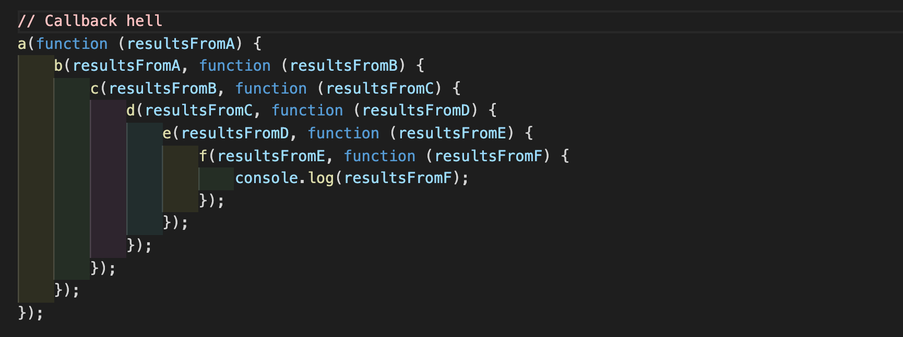

# callback function

## callback 함수란?

callback은 부르다, 호출하다 라는 의미인 call과, 뒤돌아오다, 되돌다 라는 의미인 back의 합성어로, ‘되돌아 호출해달라’라는 명령이다. 어떤 함수 A를 호출하면서 ‘특정 조건일 때 함수 B를 실행해서 나에게 알려달라’라는 요청을 함께 보내는 것이다. 이 요청을 받은 함수 A는 해당 조건이 갖춰졌는지 여부를 스스로 판단하고 B를 직접 호출한다. 즉, 콜백 함수는 다른 코드에게 인자로 넘겨지면서 그 제어권도 함께 위임하고, 콜백 함수를 위임받은 코드는 자체적인 내부 로직에 의해 콜백 함수를 적절한 시점에 실행한다.

콜백 함수는 ‘어떤 코드의 인자로 사용되는 함수’의 모습을 하고 있다. 콜백 함수를 동기적으로 실행하는 방법이 있고, 비동기적으로 실행하는 방법도 있다.

```jsx
// Synchronous callback
function printImmediately(print) {
    print();
}

printImmediately(() => console.log("sync callback"));

// Asynchronous callback
function printWithDelay(print, timeout) {
    setTimeout(print, timeout);
}

printWithDelay(() => console.log("async callback"), 2000);
```

<br>
<br>

## callback hell과 비동기 제어

콜백 지옥은 콜백 함수를 익명 함수로 전달하는 과정이 반복되어 코드의 들여쓰기 수준이 감당하기 힘들 정도로 깊어지는 현상을 말한다. 이는 가독성이 떨어지고 코드를 수정하기 어렵다는 문제를 발생시킨다.



callback hell 예시

사용자의 요청에 의해 특정 시간이 경과되기 전까지 어떤 함수의 실행을 보류한다거나(setTimeout), 사용자의 직접적인 개입이 있을 때 비로소 어떤 함수를 실행하도록 대기한다거나(addEventListener), 웹브라우저 자체가 아닌 별도의 대상에 무언가를 요청하고 그에 대한 응답이 왔을 때 비로소 어떤 함수를 실행하도록 대기하는 등(XMLHttpRequest), 별도의 요청, 실행 대기, 보류 등과 관련된 코드는 모두 비동기적인 코드이다.

현대의 자바스크립트는 웹의 복잡도가 높아진 만큼 비동기적인 코드의 비중이 예전보다 훨씬 높아졌다. 콜백 지옥에 빠지기 더 쉬워진 셈이다. 이러한 문제를 해결하기 위해 ES6에서는 Promise, Generator 등이 도입되었고, ES2017에서는 async/await이 도입되었다.
