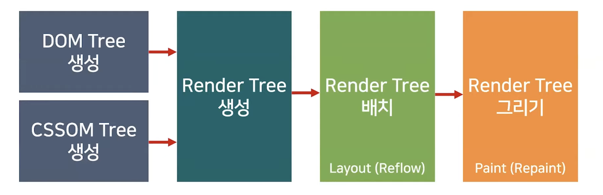

# critical rendering path

브라우저의 핵심 기능은 필요한 리소스를 서버에 요청하고 서버로부터 응답받아 브라우저에 시각적으로 렌더링 하는 것이다. 일반적으로 브라우저의 주소창에 URL을 입력하고 엔터키를 누르면 IP주소를 변환하는 등 여러 과정을 거쳐 서버에서 요청을 전송하고, 서버는 루트요청(스키마와 호스트만으로 구성된 URI 요청)에 대해 루트 폴더에 존재하는 정적 파일 index.html을 클라이언트로 응답한다. 하지만 개발자 도구의 Network 패널을 확인해보면 html 파일 뿐 아니라 CSS, 자바스크립트, 이미지, 폰트 파일들도 응답된 것을 확인할 수 있다. 이는 브라우저의 렌더링 엔진이 HTML(index.html)을 파싱하는 도중 외부 리소스를 로드하는 태그, 즉 link나 img나 script 태그 등을 만나면 HTML의 파싱을 일시 중단하고 해당 리소스 파일을 서버로 요청하기 때문이다.

+) 렌더링 엔진은 브라우저마다 다르다. Safari는 Webkit을, Firefox는 Gecko를, Chrome은 Blink를 사용한다.
<br />
<br />

## HTML 파싱과 DOM 생성


브라우저는 서버가 응답한 HTML 문서를 바이트(2진수)의 형태로 응답받고 meta의 charset에 의해 지정된 방식을 기준으로 문자열로 변환된다.(예: UTF-8) 그리고 문자열은 문법적 의미를 갖는 토큰들로 분해된다. 각 토큰들은 노드 객체로 변환되는데, 이 때 토큰의 내용에 따라 문서 노드, 요소 노드, 어트리뷰트 노드, 텍스트 노드, 주석 노드가 된다. 각 노드가 서로 연관성을 가질 수 있도록 트리를 생성하는데 이 노드들로 구성된 트리 자료구조를 **DOM**(Document Object Model)이라고 부른다. 즉, DOM은 HTML 문서를 파싱한 결과물이다.
<br />
<br />

## CSS 파싱과 CSSOM 생성

렌더링 엔진은 HTML을 처음부터 한 줄씩 순차적으로 파싱하여 DOM을 생성해 나가다가, CSS를 로드하는 link 태그나 style 태그를 만나면 DOM 생성을 일시 중단한다. 그리고 link 태그의 href 어트리뷰트에 지정된 CSS 파일을 서버에 요청하여 로드한 CSS 파일이나 style 태그 내의 CSS를 HTML과 동일한 과정을 거치며 해석하여 **CSSOM**(CSS Object Model)을 생성한다. 이후 CSS 파싱을 완료하면 HTML 파싱이 중단된 지점부터 다시 HTML을 파싱하기 시작하여 DOM 생성을 재개한다.

CSSOM은 CSS의 상속을 반영하여 생성된다. body 요소에 적용한 font-size 프로퍼티가 그 아래 노드인 span 요소에 상속된다는 것이다.

```html
// style 태그를 활용한 코드 예시

<head>
    <style>
        body {
            font-size: 100px;
        }
        span {
            color: yellowgreen;
        }
    </style>
</head>
<body>
    <span>Hello World</span>
</body>
```

<br />
<br />

## 렌더 트리 생성



렌더링 엔진은 서버로부터 응답된 HTML과 CSS를 파싱하여 각각 DOM과 CSSOM을 생성한다. 그리고 DOM과 CSSOM은 렌더링을 위한 트리 구조의 **렌더 트리**(render tree)로 결합된다. 이 때 렌더 트리는 브라우저 화면에 렌더링되는 노드만으로 구성된다. 따라서 meta 태그나 display: none; 과 같은 속성을 가진 요소들은 렌더와 관계가 없기 때문에 렌더 트리에 포함되지 않는다.

렌더 트리가 생성되었다면 Layout이라는 과정을 거친다. 이는 뷰포트 내에서 요소들의 정확한 위치와 크기를 계산하는 과정이다. CSS에서 %나 em같은 상대적 단위를 사용했다면 기기의 뷰포트에 맞춰서 픽셀(px)단위로 변환된다.

마지막으로 화면에 실제 픽셀이 그려지도록 렌더링하는 Paint 과정을 거치게 된다. 이는 텍스트, 색, 이미지, 경계 및 그림자 등 요소의 모든 시각적 부분을 그리는 작업을 포함한다. 그리기는 일반적으로 레이어라고 하는 다수의 표면에서 수행된다.

사용자 동작으로 자바스크립트가 실행되어서 DOM이나 CSSOM이 변경된 경우, 변경된 DOM과 CSSOM은 다시 렌더 트리로 결합되고 변경된 렌더 트리를 기반으로 레이아웃과 페인트 과정을 거쳐 브라우저 화면에 다시 렌더링한다. 이를 **리플로우**(reflow), **리페인트**(repaint)라고 한다.

<br />
<br />

## UI가 업데이트 되는 세 가지 상황

1. 다시 Layout이 발생하는 경우


레이아웃 너비, 높이, 왼쪽 또는 상단 위치 등 요소의 기하학적 형태에 영향을 주는 'layout' 속성을 변경하면 브라우저가 다른 모든 요소를 확인하고 페이지에 대해 리플로우를 수행해야 한다. 영향을 받은 영역이 있으면 다시 페인트해야 하고 최종적으로 페인트한 요소는 다시 합성해야 한다.

1. Paint부터 다시 발생되는 경우


페이지의 레이아웃에 영향을 주지 않는 배경 이미지, 텍스트 색상 또는 그림자 등의 속성을 변경하면, 브라우저가 레이아웃을 건너뛰되 페인트 작업은 여전히 수행한다. 리페인트가 실행되는 것이다.

1. 레이어의 합성만 다시 발생하는 경우


이 경우는 Layout과 Paint를 수행하지 않고 레이어의 합성만 발생하기 때문에 성능상으로 가장 큰 이점을 가진다.

css 속성이 변경되었을 때 세 가지 상황 중 어떤 것이 발생하는 지는 [https://csstriggers.com/](https://csstriggers.com/) 에서 확인할 수 있다.

어떤 div 요소를 오른쪽으로 왼쪽으로 이동하게 하는 애니메이션을 적용했다고 가정하자. 이를 구현하기 위해서는 A.left 속성을 변경하여 1px 움직이게 하는 방법 과 B.transform 속성을 이용하는 방법을 떠올릴 수 있다. 이 두 가지 방법은 화면상에서 동일하게 동작하는 것처럼 보이지만, 기능상으로는 큰 차이가 있다. A는 left속성이 한 프레임씩 움직일 때마다 Style-Layout-Paint-Composite 과정이 연속적으로 발생한다. 반면 B는 애니메이션이 재생되고 레이어 트리가 업데이트 된 후에(Style) 컴포넌트 합성(Composite)만 발생한다. Paint 과정 없이 애니메이션이 업데이트 되는 것이다. 이처럼 어떤 css 속성을 사용하는지가 브라우저 성능에 영향을 미칠 수 있다.

<br />
<br />

## 정리

1. 브라우저는 HTML, CSS, 자바스크립트, 이미지, 폰트 파일 등 렌더링에 필요한 리소스를 요청하고 서버로부터 응답을 받는다.
2. 브라우저의 렌더링 엔진은 서버로부터 응답된 HTML과 CSS를 파싱하여 DOM과 CSSOM을 생성하고 이들을 결합하여 렌더 트리를 생성한다.
3. 브라우저의 자바스크립트 엔진은 서버로부터 응답된 자바스크립트를 파싱하여 AST를 생성하고 바이트코드로 변환하여 실행한다. 이때 자바스크립트는 DOM API를 통해 DOM이나 CSSOM을 변경할 수 있다. 변경된 DOM과 CSSOM은 다시 렌더 트리로 결합한다.
4. 렌더 트리를 기반으로 HTML 요소의 레이아웃(위치와 크기)를 계산하고 브라우저 화면에 HTML 요소를 페인팅한다.

<br />
<br />

[출처]

-   [https://developers.google.com/web/fundamentals/performance/rendering?hl=ko](https://developers.google.com/web/fundamentals/performance/rendering?hl=ko)
-   코어 자바스크립트 (정재남 저, 위키북스)
