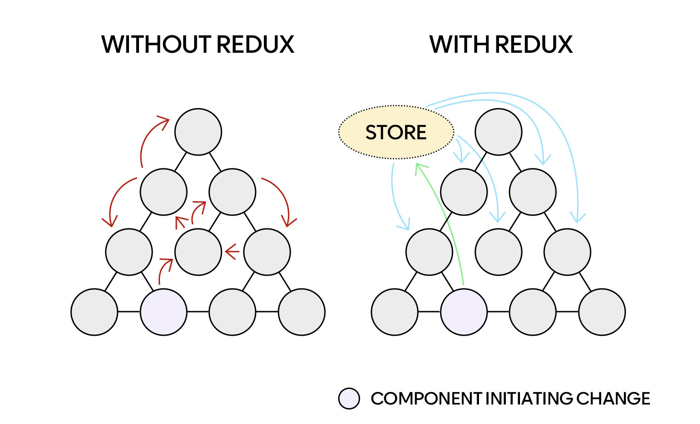
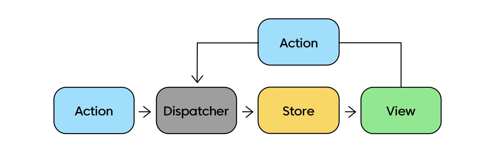

# 6장 리덕스로 상태 관리하기

### Redux 이해하기

리덕스(Redux)는 자바스크립트를 위한 상태 관리 프레임워크이다.



여러 컴포넌트를 거치지 않고 손쉽게 state를 전달하기 위해 혹은 분리해서 중앙화하기 위해 리덕스를 사용한다. 모든 설계는 데이터가 단방향으로 흐른다는 전제하에 데이터의 일관성을 향상시키고 버그 발생 원인을 더 쉽게 파악하려는 의도에서 출발했다.

<br>
<br>

### Redux를 사용 시 따라야 할 세 가지 원칙

-   전체 상탯값은 하나의 객체에 저장한다.
-   상탯값은 불변 객체이다.
-   상탯값은 순수 함수에 의해서만 변경되어야 한다.

<br>
<br>

### 주요 개념



리덕스를 사용하는 구조에서는 전역 상태를 전부 하나의 저장소(store) 안에 있는 객체 트리에 저장하며, 상태를 변경하는 것은 어떤 일이 일어날지를 서술하는 객체인 액션(action)을 내보내는(dispatch) 것이 유일한 방법이다. 그리고 액션이 전체 애플리케이션의 상태를 어떻게 변경할지 명시하기 위해서는 리듀서(reducer)의 작성이 필요하다.

-   액션(action)

    -   type 속성값을 가진 자바스크립트 객체
    -   dispatch 메서드에 넣어서 호출

    ```jsx
    // 액션 생성자 함수
    function addTodo({ title, priority }) {
        return { type: "todo/Add", title, priority };
    }

    store.dispatch(addTodo({ title: "영화 보기", priority: "high" }));
    ```

-   미들웨어(middleware)

    -   스토어와 액션 기반으로 필요한 작업을 수행
    -   디버깅을 목적으로 활용하거나, 리듀서에서 발생한 예외를 서버로 전송하는 등의 목적으로 사용가능
    -   특별히 미들웨어를 설정하지 않았다면 발생한 액션은 곧바로 리듀서로 보내짐

-   리듀서(reducer)
    -   이전 상탯값과 액션 객체를 입력으로 받아서 새로운 상탯값을 만드는 순수 함수(순수 함수란 같은 인수를 입력했을 때 항상 같은 값을 반환하는 함수를 말한다)
    -   변화를 일으키는 함수로써 전달받은 액션을 가지고 새로운 상태를 만들어서 스토어에 전달
    ```jsx
    function reducer(state = INITIAL_STATE, action){
    	switch(action.type) {
    		case INCREMENT:
    			return {
    				...
    			};
    		case DECREMENT:
    			return {
    				...
    			};
    	}
    }
    ```
-   스토어(store)
    -   리덕스의 상탯값을 가지는 객체
    -   특별한 이유가 없다면 스토어는 하나만 만드는 것이 좋음
    ```jsx
    const store = createStore(reducer, initialState);
    ```

+) Redux Toolkit

리덕스를 더 쉽게 사용하기 위한 툴. 리덕스를 라이브러리 없이 사용 하려면 1개의 액션을 생성해도 액션타입 정의 → 액션함수 생성 → 리듀서 의 작업이 필요하다. 또한, 리덕스를 유용하게 사용하려면 많은 패키지를 추가해야 하는 문제점이 있었다. 기존 리덕스의 복잡함을 낮추고 사용성을 높이기 위해 툴킷이 등장하였다.

<br>
<br>

### Context API와 Redux

리액트에서 제공하는 Context API를 이용한다면 별도의 라이브러리 없이 글로벌 상태 관리(컴포넌트 간의 데이터 교류, 특히 부모-자식 관계가 아닌 컴포넌트끼리 하는 데이터 교류)가 가능해진다. 하지만 Context API만으로는 리덕스 미들웨어와 같은 기능들을 대체할 수 없고, 규모가 큰 프로젝트의 경우 상태 업데이트 로직을 분리하는 것이 좋으므로 리덕스를 사용하는 것이 더 좋은 선택이 될 수 있다. 정적인 데이터 위주로 처리하거나 업데이트가 빈번하지 않을 경우에는 Context API 가 적합하다.

<br>
<br>

### 더 많은 상태관리 라이브러리

리덕스 상태관리의 교과서처럼 널리 사용되고 있고, 매우 ‘리액트 친화적’이다. 하지만 리덕스만이 상태관리의 유일한 옵션은 아니다. MobX나 Recoil과 같은 라이브러리 사용을 고려해볼 수 있다.

MobX는 리덕스와 달리 불변성은 크게 신경쓰지 않고, 정해진 규칙만 잘 신경쓰면 최적화가 잘된다는 장점이 있다. MobX는 리덕스와 다르게 스토어의 데이터를 액션의 발행없이 업데이트할 수 있는데, 이는 구현은 쉽고 용이하지만 테스트나 유지보수의 측면에서는 단점이 될 수 있다. 리덕스보다 러닝커브가 낮고 보일러플레이트 코드의 양이 적어서 프로젝트의 규모가 크지 않다면 MobX를 사용하는 것이 좋은 방법이 될 수 있다.

Recoil은 페이스북에서 만든 상태관리 라이브러리로, 사용이 간단하면서 관리를 효과적으로 할 수 있게 도와준다. Recoil의 핵심 컨셉은 아주 작은 단위의 atom으로 상태가 관리되고, 상태가 변경되면 atom을 참조하는 컴포넌트만 리랜더링 되기 때문에 Re-render를 최소화할 수 있다는 장점이 있다. 하지만 아직 버전이 낮기 때문에 안전성의 측면에서 좋지 못할 수 있고, DevTool이 미흡하다는 평가가 있기도 하다.

<br>

<br>

<br>

[Reference]

[http://blog.hwahae.co.kr/all/tech/tech-tech/6946/](http://blog.hwahae.co.kr/all/tech/tech-tech/6946/) : Redux Toolkit (리덕스 툴킷)은 정말 천덕꾸러기일까?

[https://velog.io/@velopert/redux-or-mobx](https://velog.io/@velopert/redux-or-mobx) : 상태 관리 라이브러리의 미학

[https://velog.io/@danmin20/상태관리-라이브러리-뭘-쓸까](https://velog.io/@danmin20/%EC%83%81%ED%83%9C%EA%B4%80%EB%A6%AC-%EB%9D%BC%EC%9D%B4%EB%B8%8C%EB%9F%AC%EB%A6%AC-%EB%AD%98-%EC%93%B8%EA%B9%8C) : 상태관리 라이브러리 뭘쓸까
